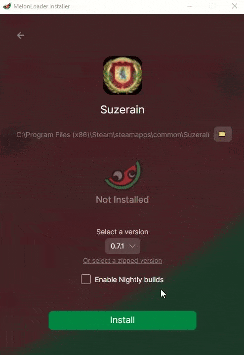

# Jouer à Suzerain en Français, en quelques clics

Chers tous,
Je mets à votre disposition cette version Française de Suzerain entièrement concoctée par mes soins. Elle inclut un installateur pour que vous puissiez éviter de vous faire chier à installer des fichiers à la main -comme c'est trop souvent le cas avec des projets de cette envergure-. La traduction n'est pas absolument parfaite mais a le mérite d'être suffisament bonne pour vous permettre de profiter du jeu, en restituant avec fidélité l'extrême majorité des dialogues / intéractions / ambiances. Il faudra parfois faire de petits efforts d'ajustements à la lecture (vous trouverez par exemple "Sordie" au lieu de "Sordland" dans quelques lignes de dialogue et autres coquilles de ce genre) mais les erreurs ne sont globalement pas plus méchantes que ça et ne devraient ni vous dérouter, ni amputer quelque information que ce soit.

## Prérequis
Si vous avez déjà installé une version de MelonLoader pour Suzerain, **désinstallez-la**.
Sinon, ignorez et passez à l'étape 1. Les autres mods ne devraient pas intérférer avec l'installation de la version Française.

## Étape 1 : Installation de MelonLoader

1. **Lancez** `MelonLoader.Installer.exe`
2. **Sélectionnez** le dossier d'installation (dans notre cas, le répertoire de Suzerain). 
3. **Cochez** "Enable Nightly builds"
4. **Choisissez** la version `0.7.2-ci.2367`

5. **Cliquez** sur "Install"

## Étape 2 : Installation du Mod

1. **Lancez** l'installateur de traduction `SuzerainTranslationInstaller.exe`
   > *Un petit menu pas très beau mais fort pratique s'ouvrira sous vos yeux*

2. **`Le Chemin vers Suzerain`** devrait être détecté automatiquement, sinon allez le sélectionner dans vos dossiers Steam\steamapps\common\Suzerain\Suzerain.exe
3. **Cliquez** sur "INSTALLER"
4. **Lancez** le jeu, et n'hésitez surtout pas à passer un bon moment ! 🎮

## Notes
- Si vous rencontrez des problèmes, vérifiez que vous avez bien suivi toutes les étapes
- Je mets à disposition cette (imparfaite) version Française en l'état pour que vous puissiez expérimenter le jeu en Français. 
Aucune maintenance future n'est garantie et la compatibilité avec les versions à venir dépend entièrement de la façon dont Torpor revisite ou non ses schémas de données.