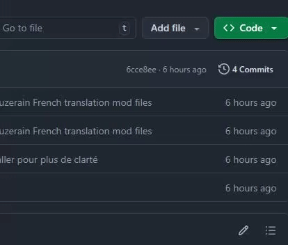

# Jouer à Suzerain en Français, c'est possible !

Chers amis,
je mets à votre disposition ce patch Français de Suzerain. Il vient avec un utilitaire qui permet d'installer / désinstaller la traduction en quelques clics afin de vous éviter de nombreux maux de tête.

Si la traduction n'est pas parfaite, elle peut tout de même se vanter d'être solide, et permet de restituer avec une redoutable fidélité l'extrême majorité des dialogues / intéractions et ambiances. Il vous faudra parfois faire de petits efforts d'ajustements à la lecture (vous trouverez par exemple "La Sordie" au lieu de "Sordland" dans quelques lignes de dialogue et autres coquilles de ce genre) afin de passer outre les petits ratés qu'un tel volume de traduction implique forcément.

Les quelques erreurs présentes ne devraient pas vraiment vous dérouter, ni amputer quelque information que ce soit.

### Comment télécharger le mod ?
Certains d'entre-vous auront probablement du mal à localiser le bouton de téléchargement (classique sur Github), c'est le bouton vert "Code" puis "Download ZIP" en haut à droite de cette page !

Dézippez le tout dans un dossier, et suivez le reste du tutoriel.

## Étape 1 : Installation de MelonLoader dans le dossier Suzerain

1. **Lancez** `MelonLoader.Installer.exe`
(Si vous avez déjà installé une version de MelonLoader pour Suzerain, désinstallez-la.)
2. **Sélectionnez** Suzerain depuis le menu MelonLoader
3. **Cochez** "Enable Nightly builds"
4. **Choisissez** la version `0.7.2-ci.2367`
5. **Cliquez** sur "Install"

## Étape 2 : Installation du Mod

1. **Lancez** l'installateur de traduction `SuzerainTranslationInstaller.exe`
   > *Un petit menu pas très beau mais fort pratique s'ouvrira sous vos yeux*

2. **`Le Chemin vers Suzerain`** devrait être détecté automatiquement, sinon localisez le jeu dans vos dossiers Steam\steamapps\common\Suzerain\Suzerain.exe

3. **Cliquez** sur "INSTALLER"

4. **Lancez** le jeu, et n'hésitez surtout pas à passer un bon moment ! 🎮

La toute première fois que vous lancerez le jeu, MelonLoader devra terminer son installation. Il mettra en pause le démarrage du jeu durant quelques secondes / minutes durant cette phase. Pas de panique si la fenêtre Suzerain ne répond donc pas: c'est tout à fait normal.

## Notes
Aucune maintenance future n'est garantie et la compatibilité avec les versions à venir dépend entièrement de la façon dont Torpor revisite ou non ses schémas de données.

Délicieuse session à vous !